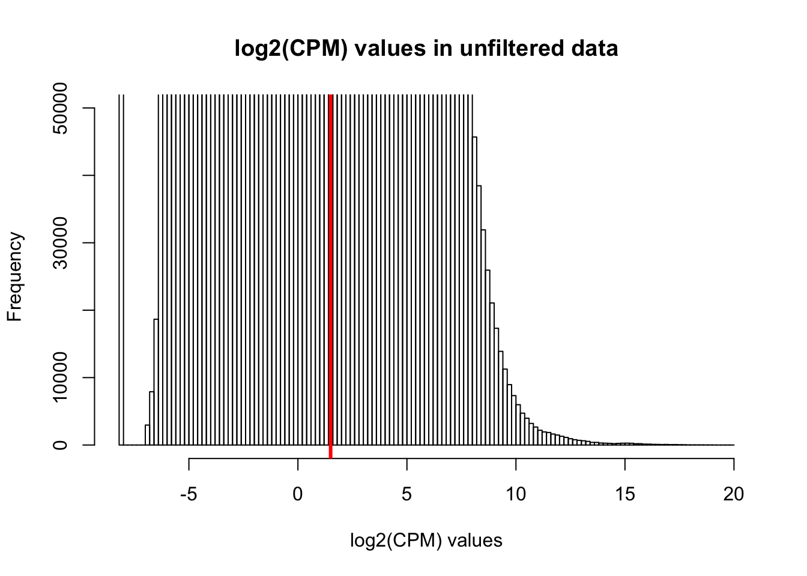

# Get GTEx data

```r
# Libraries
library(limma)
library(edgeR)
library(qdap)
```

```
## Warning: package 'qdap' was built under R version 3.4.4
```

```
## Loading required package: qdapDictionaries
```

```
## Warning: package 'qdapDictionaries' was built under R version 3.4.4
```

```
## Loading required package: qdapRegex
```

```
## Loading required package: qdapTools
```

```
## Loading required package: RColorBrewer
```

```
## 
## Attaching package: 'qdap'
```

```
## The following object is masked from 'package:limma':
## 
##     fry
```

```
## The following object is masked from 'package:base':
## 
##     Filter
```

```r
Hearts.LV <- read.delim("~/Desktop/Regulatory_Evol/ashlar-trial/data/gtex_v7_counts/Hearts.LV.read_counts")

HRTLV <- read.table("~/Desktop/Regulatory_Evol/ashlar-trial/data/gtex_v7_counts/HRTLV.keep.txt", quote="\"", comment.char="", stringsAsFactors = FALSE)

# Keep gene name

gene_names <- as.matrix(c("Name", "Description"))
hits <- rbind(gene_names, HRTLV, stringsAsFactors = FALSE)

# Make the individual names match

ind_names <- beg2char(colnames(Hearts.LV), ".", 2)

colnames(Hearts.LV) <- ind_names


# Remove duplicates
test = as.data.frame(table(ind_names), stringsAsFactors = FALSE)
only_appear_once <- test[which(test$Freq == 1),]


inshared_lists = only_appear_once$ind_names %in% colnames(Hearts.LV)
summary(inshared_lists)
```

```
##    Mode    TRUE 
## logical     306
```

```r
inshared_lists = colnames(Hearts.LV) %in% only_appear_once$ind_names
summary(inshared_lists)
```

```
##    Mode   FALSE    TRUE 
## logical      48     306
```

```r
keep_unique <- which(inshared_lists == TRUE)

Hearts.LV <- Hearts.LV[,keep_unique]


ind_names_matching <- gsub('.', '-' ,colnames(Hearts.LV), fixed=TRUE)

colnames(Hearts.LV) <- ind_names_matching

# Use individuals that were in GTEx

inshared_lists = colnames(Hearts.LV) %in% unlist(hits)
summary(inshared_lists)
```

```
##    Mode   FALSE    TRUE 
## logical      49     257
```

```r
keep_unique <- which(inshared_lists == TRUE)

Hearts.LV <- Hearts.LV[,keep_unique]
dim(Hearts.LV)
```

```
## [1] 56202   257
```

```r
# Make function

tissue_formatting <-function(data, hits){
  Hearts.LV <- data
  HRTLV <- hits
  
  gene_names <- as.matrix(c("Name", "Description"))
hits <- rbind(gene_names, HRTLV, stringsAsFactors = FALSE)

# Make the individual names match

ind_names <- beg2char(colnames(Hearts.LV), ".", 2)

colnames(Hearts.LV) <- ind_names


# Remove duplicates
test = as.data.frame(table(ind_names), stringsAsFactors = FALSE)
only_appear_once <- test[which(test$Freq == 1),]


inshared_lists = only_appear_once$ind_names %in% colnames(Hearts.LV)
summary(inshared_lists)


inshared_lists = colnames(Hearts.LV) %in% only_appear_once$ind_names
summary(inshared_lists)

keep_unique <- which(inshared_lists == TRUE)

Hearts.LV <- Hearts.LV[,keep_unique]


ind_names_matching <- gsub('.', '-' ,colnames(Hearts.LV), fixed=TRUE)

colnames(Hearts.LV) <- ind_names_matching

# Use individuals that were in GTEx

inshared_lists = colnames(Hearts.LV) %in% unlist(hits)
summary(inshared_lists)

keep_unique <- which(inshared_lists == TRUE)

Hearts.LV <- Hearts.LV[,keep_unique]
dim(Hearts.LV)
return(Hearts.LV)
  
}

# Check for hearts

gtex_heart <- tissue_formatting(Hearts.LV, HRTLV)


# Liver

#liver_data <- read.delim("../data/gtex_v7_counts/liver.read_counts")

#keep_liver_data <- read.table("../data/gtex_v7_counts/LIVER.keep.txt", quote="\"", comment.char="", stringsAsFactors = FALSE)


#gtex_liver <- tissue_formatting(liver_data, keep_liver_data)

# Lung

# Add lung
lung_data <- read.delim("./data/gtex_v7_counts/lungs.read_counts")

keep_lung_data <- read.table("./data/gtex_v7_counts/LUNG.keep.txt", quote="\"", comment.char="", stringsAsFactors = FALSE)


gtex_lung <- tissue_formatting(lung_data, keep_lung_data)

length(intersect(colnames(gtex_lung), colnames(gtex_heart)))
```

```
## [1] 176
```

```r
# Get counts of genes included in the analysis

rownames(gtex_heart) <- gtex_heart[,1]
#rownames(gtex_liver) <- gtex_liver[,1]
rownames(gtex_lung) <- gtex_lung[,1]

gtex_heart_ind <- gtex_heart[,-(1:2)]
#gtex_liver_ind <- gtex_liver[,-(1:2)]
gtex_lung_ind <- gtex_lung[,-(1:2)]

counts_genes <- cbind(gtex_heart[,3:257], gtex_lung[,3:365])
rownames(counts_genes) <- gtex_heart[,1]

# Make labels
heart_label <- array("heart", dim = c(1, ncol(gtex_heart)-2))
lung_label <- array("lung", dim = c(1,ncol(gtex_lung)-2))


labels <- cbind(heart_label, lung_label)

# Set expression cutoff and sample number
expr_cutoff <- 1.5
sample_number <- round(ncol(counts_genes)/2)

# log2(CPM) adjusted for library sizes

dge_original <- DGEList(counts=as.matrix(counts_genes), genes=rownames(counts_genes), group = as.character(t(labels)))
```

```
## Repeated column names found in count matrix
```

```r
dge_original <- calcNormFactors(dge_original)

cpm <- cpm(dge_original, normalized.lib.sizes=TRUE, log=TRUE, prior.count = 0.25)

hist(cpm, main = "log2(CPM) values in unfiltered data", breaks = 100, ylim = c(0, 50000), xlab = "log2(CPM) values")
abline(v = expr_cutoff, col = "red", lwd = 3)
```



```r
cpm_filtered <- cpm[rowSums(cpm > expr_cutoff) >= sample_number, ]
dim(cpm_filtered)
```

```
## [1] 12688   618
```

```r
inshared_lists = row.names(counts_genes) %in% rownames(cpm_filtered)
inshared_lists_data <- as.data.frame(inshared_lists)
counts_genes_in <- cbind(counts_genes, inshared_lists_data)
counts_genes_in_cutoff <- subset(counts_genes_in, inshared_lists_data == "TRUE")
counts_genes_in_cutoff <- counts_genes_in_cutoff[,1:618]


# Take the TMM of the genes that meet the criteria

dge_in_cutoff <- DGEList(counts=as.matrix(counts_genes_in_cutoff), genes=rownames(counts_genes_in_cutoff), group = as.character(t(labels)))
dge_in_cutoff <- calcNormFactors(dge_in_cutoff)

dge_in_cutoff_dot <- beg2char(rownames(dge_in_cutoff), ".", 1)
rownames(dge_in_cutoff) <- dge_in_cutoff_dot

cpm_in_cutoff <- cpm(dge_in_cutoff, normalized.lib.sizes=TRUE, log=TRUE, prior.count = 0.25)


# GTEx genes matching filtering criteria 
gtex_gene_names <- beg2char(rownames(cpm_in_cutoff), ".", 1)

# Tissue paper genes
cpm_12184 <- read.delim("~/Desktop/Reg_Evo_Primates/data/cpm_12184.txt")

length(intersect(gtex_gene_names, rownames(cpm_12184)))
```

```
## [1] 10456
```

```r
common_genes_ind <- intersect(gtex_gene_names, rownames(cpm_12184))

common_79_ind <- intersect(colnames(gtex_heart_ind), colnames(gtex_lung_ind))
common_79_ind_dot <- gsub('-', '.' , common_79_ind, fixed=TRUE)

# Ind names

  # Heart

shared_list <- colnames(gtex_heart_ind) %in% common_79_ind
heart_common_ind <- c(which(shared_list, useNames = TRUE))
common_ind_heart <- gtex_heart_ind[,heart_common_ind]

gene_names <- beg2char(rownames(common_ind_heart), ".", 1)
rownames(common_ind_heart) <- gene_names
  
shared_list <- rownames(common_ind_heart) %in% common_genes_ind
heart_common_ind <- c(which(shared_list, useNames = TRUE))
common_ind_heart_counts <- gtex_heart_ind[heart_common_ind,]

colnames(common_ind_heart_counts) <- gsub('-', '.' , colnames(common_ind_heart_counts), fixed=TRUE)

 # Lung

shared_list <- colnames(gtex_lung_ind) %in% common_79_ind
lung_common_ind <- c(which(shared_list, useNames = TRUE))
common_ind_lung <- gtex_lung_ind[,lung_common_ind]

gene_names <- beg2char(rownames(common_ind_lung), ".", 1)
rownames(common_ind_lung) <- gene_names
  
shared_list <- rownames(common_ind_lung) %in% common_genes_ind
lung_common_ind <- c(which(shared_list, useNames = TRUE))
common_ind_lung_counts <- gtex_lung_ind[lung_common_ind,]

name_genes_counts <- beg2char(rownames(common_ind_lung_counts), ".")
rownames(common_ind_lung_counts) <- name_genes_counts

colnames(common_ind_lung_counts) <- gsub('-', '.' , colnames(common_ind_lung_counts), fixed=TRUE)

  # Lung
#ind_names_matching <- gsub('-', '.' ,colnames(gtex_lung_ind), fixed=TRUE)
#colnames(gtex_lung_ind) <- ind_names_matching

#shared_list <- colnames(gtex_lung_ind) %in% common_79_ind
#lung_common_ind <- c(which(shared_list, useNames = TRUE))
#common_ind_lung <- gtex_lung_ind[,lung_common_ind]

#gene_names <- beg2char(rownames(common_ind_lung), ".", 1)
#rownames(common_ind_lung) <- gene_names

#shared_list <- rownames(gtex_lung_ind) %in% rownames(common_genes_ind)
#lung_common_ind <- c(which(shared_list, useNames = TRUE))
#common_ind_lung_counts <- gtex_lung_ind[lung_common_ind,]
```


# Use individuals with sex = 1 and platform = 1 (so you don't have to include these as covariates)


```r
# Covariates
Heart_covar <- read.delim("./data/Heart_Left_Ventricle.v7.covariates.txt")
rownames(Heart_covar) <- Heart_covar[,1]
t_heart_covar <- t(Heart_covar[,-(1)])

#Liver_covar <- read.delim("../data/Liver.v7.covariates.txt")
#rownames(Liver_covar) <- Liver_covar[,1]
#t_liver_covar <- t(Liver_covar[,-(1)])

Lung_covar <- read.delim("./data/Lung.v7.covariates.txt")
rownames(Lung_covar) <- Lung_covar[,1]
t_lung_covar <- t(Lung_covar[,-(1)])

heart_platform <- t(t_heart_covar[which(t_heart_covar[,49] == 1 & t_heart_covar[,50] == 1),])

#liver_platform <- t(t_liver_covar[which(t_liver_covar[,34] == 1 & t_liver_covar[,35] == 1),])

lung_platform <- t(t_lung_covar[which(t_lung_covar[,64] == 1 & t_lung_covar[,65] == 1),])

# Use first 6 covariates (3 genotype PCs and 3 PEER factors)

heart_platform_6 <- heart_platform[1:6,]
#liver_platform_6 <- liver_platform[1:6,]
lung_platform_6 <- lung_platform[1:6,]

# Find the gene counts only for the individuals in the sample

overlap_ids_dot <- intersect(intersect(intersect(colnames(common_ind_heart_counts), colnames(heart_platform_6)), colnames(common_ind_lung_counts)), colnames(lung_platform_6))

# Heart
shared_list <- overlap_ids_dot %in% colnames(common_ind_heart_counts)
heart_common_ind <- c(which(shared_list, useNames = TRUE))
common_ind_heart_counts_platform <- common_ind_heart_counts[,heart_common_ind]

shared_list <- overlap_ids_dot %in% colnames(heart_platform_6)
heart_common_ind <- c(which(shared_list, useNames = TRUE))
heart_platform_6 <- heart_platform_6[,heart_common_ind]

# Lung
shared_list <- overlap_ids_dot %in% colnames(common_ind_lung_counts)
lung_common_ind <- c(which(shared_list, useNames = TRUE))
common_ind_lung_counts_platform <- common_ind_lung_counts[,lung_common_ind]

shared_list <- overlap_ids_dot %in% colnames(lung_platform_6)
lung_common_ind <- c(which(shared_list, useNames = TRUE))
lung_platform_6 <- lung_platform_6[,lung_common_ind]


t_heart_platform_6 <- t(heart_platform_6)
t_lung_platform_6 <- t(lung_platform_6)

summary(rownames(t_heart_platform_6) == rownames(t_lung_platform_6))
```

```
##    Mode   FALSE 
## logical     103
```

```r
# Finalize covariates

four_cov <- rbind(t_heart_platform_6, t_lung_platform_6)
four_cov <- as.data.frame(four_cov)
```


# Run DE in all individuals


